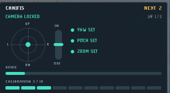

# Rooftop Camera Planner

Rooftop Camera Planner is a RuneLite plugin for players who want less fiddling
with the camera while training Agility. It learns a practical view for each
supported rooftop course on *your* client, then shows quiet M-markers over the
next obstacle's safer click area when that saved camera view is active.



## The short version

1. Enable the plugin and start a supported rooftop course.
2. Follow the compact radar while it samples a few valid laps.
3. Once the camera is locked, keep that view and use the M-markers as a visual
   aid for the next clicks.

The plugin keeps its learned camera profiles in your local RuneLite settings.
There is no account login, network sync, uploaded gameplay data, or input
automation.

## What it helps with

- Recognizes supported rooftop courses and their ordered obstacles.
- Learns a low-travel camera layout from real, in-game click geometry.
- Scores candidate views by overlap, remaining marker gap, and practical cursor
  travel instead of pretending there is one perfect view for every setup.
- Gives simple turn, tilt, and zoom guidance during calibration.
- Learns reachable camera limits, including normal versus expanded pitch and
  zoom limits, without asking the player to configure them first.
- Detects forced rooftop camera shifts and avoids treating those laps as proof
  that an otherwise good view is bad.
- Ignores incidental actions, including Marks of Grace, when it evaluates the
  obstacle route.
- Keeps the screen clear while the camera is settling; markers return only when
  their saved view is actually aligned.

## Supported courses

Draynor Village, Al Kharid, Varrock, Canifis, Falador, Seers' Village,
Pollnivneach, Rellekka, and Ardougne.

## What it deliberately does **not** do

Rooftop Camera Planner never moves the camera, mouse, or character. It does not
click obstacles, select menus, or issue any game input. It is a local visual
planning aid; the player remains responsible for every in-game action.

## Calibration that respects a real session

Initial calibration uses six valid laps. A fall, a skipped obstacle, an
unsettled room-to-roof transition, a forced camera change, or a Mark of Grace
does not count as a clean calibration lap. Once a working view is found, turn
on **Refine camera (+2 laps)** only when you want the plugin to look for a
slightly better option without discarding the evidence it already collected.

If the RuneLite client, display size, or your camera limits change enough to
make a profile unreliable, the plugin asks for new evidence instead of drawing
stale click markers.

## Install and update

When the plugin is available through the RuneLite Plugin Hub, install it from
the hub and let RuneLite handle updates. For a development build:

```powershell
.\gradlew.bat run
```

Enable **Rooftop Camera Planner** in the development client, then begin a lap
on a supported course.

## Compatibility and support

Version `0.1.2` was rebuilt and tested against the current RuneLite
`latest.release` dependency after the August 25, 2026 game update. If a future
game update changes rooftop object IDs or camera behavior, please include the
course, a screenshot, and the RuneLite version in an issue so it can be
reproduced cleanly.

## Development

```powershell
.\gradlew.bat clean test
```

The project uses the standard Plugin Hub build and has no third-party runtime
dependencies beyond RuneLite.
