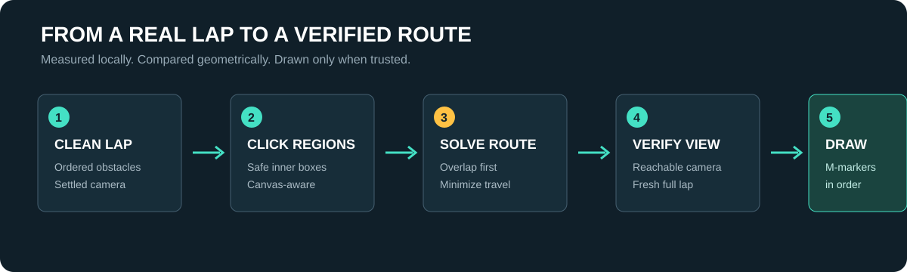
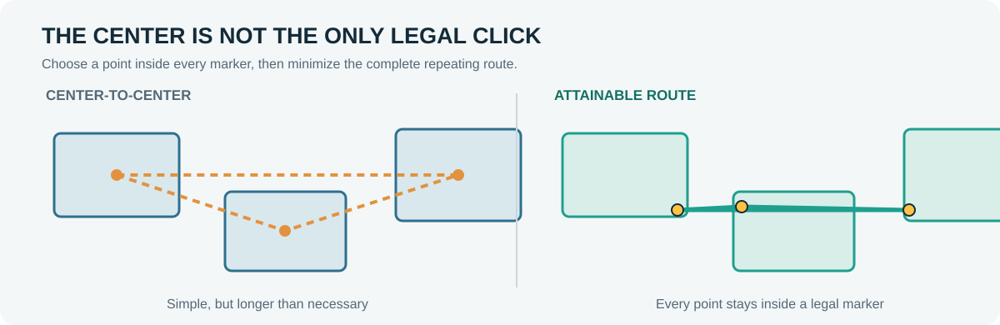

<p align="center"></p>
<h1 align="center">Rooftop Camera Planner</h1>
<p align="center">A local RuneLite camera optimizer for rooftop Agility.<br>Less camera fiddling. Shorter mouse routes. Every click still belongs to you.</p>

<p align="center">
  
  
  
  
</p>

---

Most rooftop plugins show you **what** to click. This one also helps you find a camera position where those clicks are packed as closely together as your client, display, camera limits, and course geometry allow.

It watches complete laps, measures the obstacle clickboxes that RuneLite already exposes, tests practical camera views, and saves the best verified layout for each course. When that camera is aligned, the plugin draws numbered `M` markers over the safe screen regions for the route.


## What makes it different

| Ordinary obstacle highlighting | Rooftop Camera Planner |
| --- | --- |
| Highlights the next obstacle | Learns a complete ordered screen route |
| Uses the camera you already chose | Compares reachable yaw, pitch, and zoom candidates |
| Treats clickboxes as points | Optimizes across the full legal area of every clickbox |
| Starts over when something is odd | Preserves valid history and rejects contaminated laps |
| Assumes one layout fits everyone | Stores a separate local profile for your setup |

The plugin does **not** move the camera, mouse, or character. It does not click, queue actions, or send gameplay data anywhere. It is a visual planning tool.

## How it works

<p align="center"></p>

1. **Map the course.** Each supported rooftop is represented as an ordered set of logical obstacles. Alternate object IDs, such as the two valid Falador ledges, belong to the same logical step.
2. **Collect a clean lap.** The plugin records one click region per obstacle. Skipped steps, falls, camera movement, room-to-roof settling, and incidental clicks do not become optimization evidence.
3. **Test reachable views.** Calibration explores camera candidates inside the limits your client can actually reach. It learns those limits instead of assuming expanded pitch or a particular zoom range.
4. **Score the geometry.** Every candidate is compared by overlap, uncovered gap, and the shortest cyclic route through legal click points.
5. **Verify before drawing.** Saved markers are shown only when their layout, canvas size, camera position, and verification state agree with the current client.

## The math, without pretending it is magic

For a course with marker rectangles `R0 ... Rn-1`, the useful question is not "how far apart are the rectangle centers?" The mouse can click **anywhere inside** each rectangle. The real objective is:

```text
choose pi inside Ri for every obstacle i

minimize  sum distance(pi, p(i+1))
          i=0..n-1

where pn = p0 because a rooftop route repeats
```

That is a constrained cyclic route problem. The solver starts at each marker's center, follows the travel gradient, and clamps every candidate point back inside its legal rectangle. If every marker shares a common intersection, the answer is exactly `0 px`: one cursor position can reach the whole route.

<p align="center"></p>

The plugin tracks four related measurements:

- **Overlapping transitions** - consecutive route markers that already touch.
- **Overlap area** - how much usable shared area those transitions provide.
- **Marker gap** - unavoidable edge-to-edge distance when markers do not touch.
- **Attainable travel** - the optimized complete loop through legal click points, including the final obstacle back to the first.

Camera candidates are compared with overlap first, then overlap area, smaller gap, and finally travel. Representative layouts use attainable travel as the dominant cost so a large but badly positioned clickbox cannot win by accident.

For implementation details and equations, see [The optimizer](docs/MATH.md).

## Calibration

Initial calibration uses **six valid laps**. These are evidence laps, not simply six trips around the roof. A lap is excluded when it would teach the plugin the wrong thing, including:

- an obstacle is skipped or visited out of order;
- the player falls from the course;
- the camera changes during measurement;
- the game forces a room-to-roof camera transition;
- a target exceeds the camera limits available on that client;
- a clickbox is missing or the screen layout is not yet settled.

Marks of Grace are ignored as route steps. They do not erase otherwise useful history. After calibration, **Refine camera (+2 laps)** asks for two additional evidence laps without throwing away the views already measured.

## Reading the radar

| Display | Meaning |
| --- | --- |
| `CAMERA LOCKED` | Yaw, pitch, and zoom match the verified saved view |
| Radar dot | Direction and scale of the yaw/pitch adjustment |
| Zoom rail | Zoom in/out adjustment still required |
| `ROUTE` | Progress through the current logical obstacle sequence |
| `CALIBRATION` | Accepted evidence laps, not raw laps attempted |
| `BEST OBSERVED` | Best overlapping route transitions found |
| `MARKER GAP` | Remaining edge-to-edge route distance |
| `TESTED VIEWS` | Distinct camera candidates with recorded evidence |
| `LAST LAP` | Observed cursor travel for the latest accepted lap |

## Supported rooftop courses

| Course | Logical steps | Notes |
| --- | ---: | --- |
| Draynor Village | 7 | Full ordered route |
| Al Kharid | 8 | Full ordered route |
| Varrock | 9 | Full ordered route |
| Canifis | 8 | Full ordered route |
| Falador | 13 | Alternate ledges are one logical step |
| Seers' Village | 6 | Full ordered route |
| Pollnivneach | 9 | Full ordered route |
| Rellekka | 7 | Full ordered route |
| Ardougne | 7 | Full ordered route |

Every route has regression coverage for exact step count, ordering, wraparound, and complete-lap acceptance. Falador additionally runs complete tests through both legal ledge variants.

## Privacy and fair-play boundary

Everything learned by the plugin stays in local RuneLite configuration.

**It reads:** course region, obstacle IDs, clickbox geometry, canvas dimensions, camera state, route progression, and local mouse position while measuring.

**It never does:** mouse movement, camera movement, clicks, menu selection, character control, network sync, account login, or gameplay upload.

## Install

When approved for the RuneLite Plugin Hub:

1. Open RuneLite settings.
2. Open **Plugin Hub**.
3. Search for **Rooftop Camera Planner**.
4. Install and enable it.

For a local development client:

```powershell
.\gradlew.bat run
```

## Troubleshooting

### My lap did not count

The lap was probably not clean optimization evidence. Finish one full route without changing the camera. If the course offers alternate objects, either valid object should count as its shared logical step.

### The obstacle outlines appear but the M-markers do not

The scene route is known, but the saved screen layout has not passed its current verification gate. Align the requested camera and complete the verification lap. The plugin deliberately refuses to draw stale click targets.

### The requested camera position is unreachable

Move as far as your client permits. Repeated movement at a real limit teaches the bounds tracker that the target is unreachable, allowing calibration to select another candidate.

### A game or RuneLite update changed the course

Open an issue with the course, RuneLite version, and a screenshot. Do not erase your profile first; the existing evidence is useful for diagnosis.

## Build and verify

```powershell
.\gradlew.bat clean test build
```

The project targets Java 11 and RuneLite `latest.release`. The suite covers camera guidance, reachability, forced shifts, course progression, lap scoring, screen-marker scaling and validation, search-history persistence, compound-view prediction, and the constrained route optimizer.

See [Testing and release proof](docs/TESTING.md) for the full verification map.

## Project notes

- [Changelog](CHANGELOG.md)
- [Optimizer and scoring model](docs/MATH.md)
- [Testing and release proof](docs/TESTING.md)
- [Third-party notices](THIRD_PARTY_NOTICES.md)
- [BSD 2-Clause License](LICENSE)

Built by **MVP IT Solutions** because rooftop Agility should require less camera work, not more.
